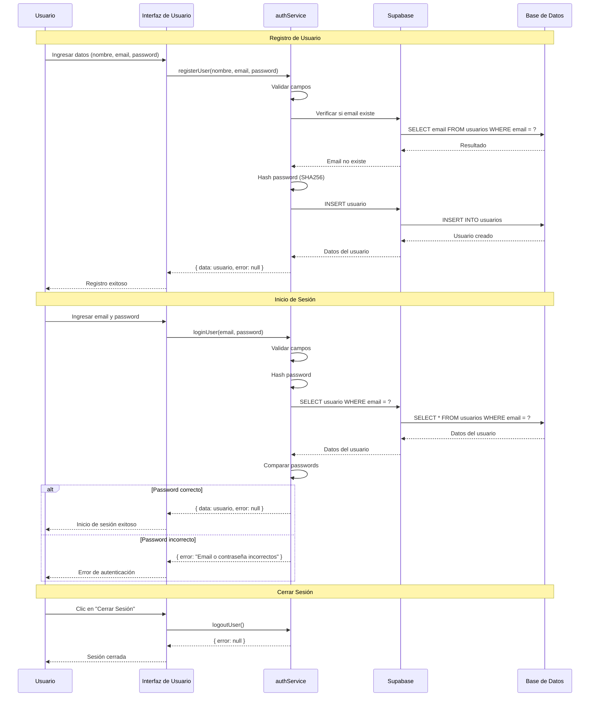
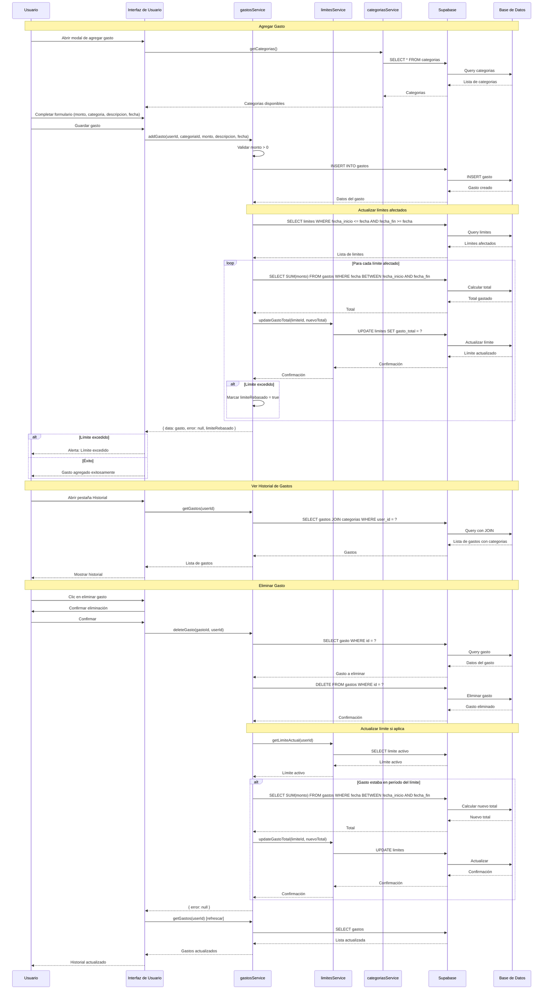
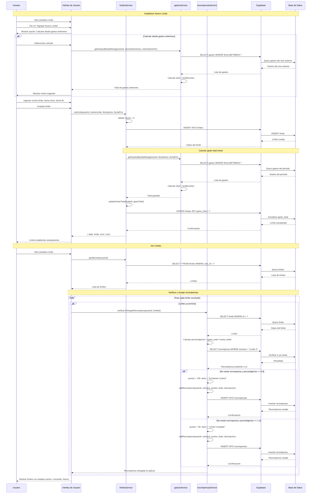
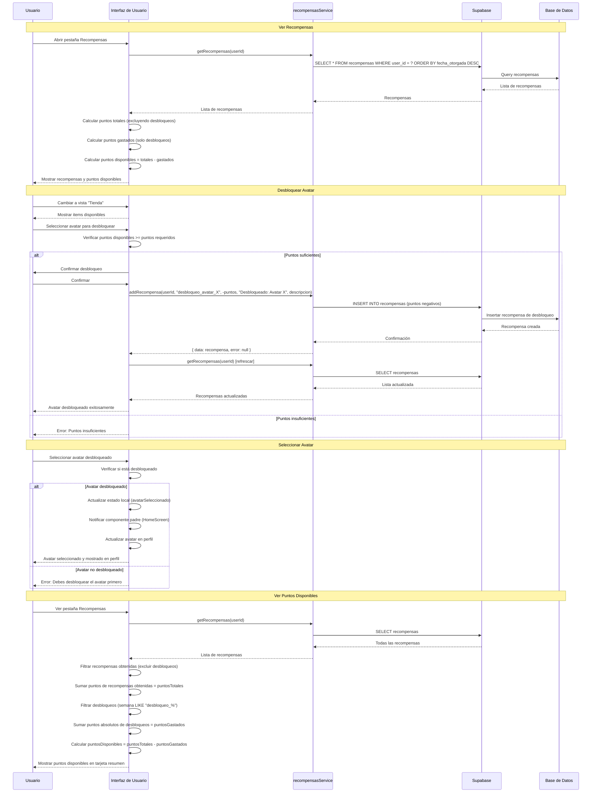

# Diagramas de Casos de Uso y Secuencias - ExpTrack

Este documento contiene los diagramas de casos de uso y secuencias generales del sistema ExpTrack.

## 📋 Índice

1. [Diagrama de Casos de Uso General](#diagrama-de-casos-de-uso-general)
2. [Diagrama de Secuencia - Autenticación](#diagrama-de-secuencia---autenticación)
3. [Diagrama de Secuencia - Gestión de Gastos](#diagrama-de-secuencia---gestión-de-gastos)
4. [Diagrama de Secuencia - Sistema de Límites](#diagrama-de-secuencia---sistema-de-límites)
5. [Diagrama de Secuencia - Sistema de Recompensas](#diagrama-de-secuencia---sistema-de-recompensas)

---

## Diagrama de Casos de Uso General

```mermaid
graph TB
    Usuario[Usuario]
    
    %% Autenticación
    UC1[Registrarse]
    UC2[Iniciar Sesión]
    UC3[Cerrar Sesión]
    
    %% Gestión de Gastos
    UC4[Agregar Gasto]
    UC5[Ver Historial de Gastos]
    UC6[Eliminar Gasto]
    UC7[Ver Estadísticas y Gráficas]
    
    %% Sistema de Límites
    UC8[Establecer Límite de Gastos]
    UC9[Ver Límites Activos]
    UC10[Calcular Límite desde Gastos Anteriores]
    
    %% Sistema de Recompensas
    UC11[Ver Recompensas]
    UC12[Desbloquear Avatar]
    UC13[Seleccionar Avatar]
    UC14[Ver Puntos Disponibles]
    
    %% Chatbot
    UC15[Consultar Gastos vía Chatbot]
    UC16[Consultar Límites vía Chatbot]
    UC17[Obtener Consejos de Ahorro]
    UC18[Ver Análisis de Gastos]
    
    %% Perfil
    UC19[Ver Perfil]
    UC20[Actualizar Información de Perfil]
    
    Usuario --> UC1
    Usuario --> UC2
    Usuario --> UC3
    Usuario --> UC4
    Usuario --> UC5
    Usuario --> UC6
    Usuario --> UC7
    Usuario --> UC8
    Usuario --> UC9
    Usuario --> UC10
    Usuario --> UC11
    Usuario --> UC12
    Usuario --> UC13
    Usuario --> UC14
    Usuario --> UC15
    Usuario --> UC16
    Usuario --> UC17
    Usuario --> UC18
    Usuario --> UC19
    Usuario --> UC20
    
    style Usuario fill:#5B715B,stroke:#333,stroke-width:2px,color:#fff
    style UC1 fill:#E8F5E9,stroke:#4CAF50
    style UC2 fill:#E8F5E9,stroke:#4CAF50
    style UC3 fill:#E8F5E9,stroke:#4CAF50
    style UC4 fill:#E3F2FD,stroke:#2196F3
    style UC5 fill:#E3F2FD,stroke:#2196F3
    style UC6 fill:#E3F2FD,stroke:#2196F3
    style UC7 fill:#E3F2FD,stroke:#2196F3
    style UC8 fill:#FFF3E0,stroke:#FF9800
    style UC9 fill:#FFF3E0,stroke:#FF9800
    style UC10 fill:#FFF3E0,stroke:#FF9800
    style UC11 fill:#F3E5F5,stroke:#9C27B0
    style UC12 fill:#F3E5F5,stroke:#9C27B0
    style UC13 fill:#F3E5F5,stroke:#9C27B0
    style UC14 fill:#F3E5F5,stroke:#9C27B0
    style UC15 fill:#E0F2F1,stroke:#009688
    style UC16 fill:#E0F2F1,stroke:#009688
    style UC17 fill:#E0F2F1,stroke:#009688
    style UC18 fill:#E0F2F1,stroke:#009688
    style UC19 fill:#FAFAFA,stroke:#757575
    style UC20 fill:#FAFAFA,stroke:#757575
```

---

## Diagrama de Secuencia - Autenticación

---

## Diagrama de Secuencia - Gestión de Gastos

---

## Diagrama de Secuencia - Sistema de Límites

---

## Diagrama de Secuencia - Sistema de Recompensas

---

## Notas sobre los Diagramas

### Casos de Uso
- **Autenticación**: Registro, inicio de sesión y cierre de sesión
- **Gestión de Gastos**: CRUD completo de gastos con categorización
- **Sistema de Límites**: Establecimiento y seguimiento de límites de gasto
- **Sistema de Recompensas**: Obtención de puntos y desbloqueo de avatares
- **Chatbot**: Consultas interactivas sobre gastos y límites
- **Perfil**: Visualización y gestión de información del usuario

### Secuencias
- Todas las secuencias muestran la interacción completa entre componentes
- Se incluyen validaciones y manejo de errores
- Las actualizaciones de límites son automáticas cuando se agregan/eliminan gastos
- El sistema de recompensas se verifica automáticamente al cargar límites

---

**Última actualización**: 2024
**Versión del documento**: 1.0

