# Diagramas de Caso de Uso - Administrador

## ⚠️ Nota Importante

**Este documento no aplica para el sistema ExpTrack actual.**

### Razón

El sistema ExpTrack es una aplicación móvil de seguimiento de gastos personales diseñada exclusivamente para usuarios finales. No existe un rol de administrador en la arquitectura actual del sistema.

### Características del Sistema Actual

- **Arquitectura**: Aplicación móvil con backend Supabase
- **Usuarios**: Solo usuarios finales (personas que gestionan sus propios gastos)
- **Autenticación**: Sistema de autenticación personalizado sin roles
- **Base de Datos**: Cada usuario solo puede acceder a sus propios datos mediante `user_id`

### ¿Por qué no hay administrador?

1. **Propósito del Sistema**: ExpTrack está diseñado para uso personal, donde cada usuario gestiona únicamente sus propios gastos, límites y recompensas.

2. **Seguridad**: Los datos están aislados por usuario mediante el campo `user_id` en todas las tablas. No hay necesidad de un administrador que gestione múltiples usuarios.

3. **Simplicidad**: La aplicación se enfoca en la experiencia del usuario final, sin complejidad administrativa.

### Si se implementara un rol de administrador en el futuro

En caso de que en el futuro se requiera agregar funcionalidad de administrador, los casos de uso podrían incluir:

#### Posibles Casos de Uso de Administrador (Futuro)

```mermaid
graph TB
    Admin[Administrador]
    
    %% Gestión de Usuarios
    UC1[Ver Lista de Usuarios]
    UC2[Ver Detalles de Usuario]
    UC3[Desactivar Usuario]
    UC4[Eliminar Usuario]
    
    %% Gestión de Categorías Globales
    UC5[Crear Categoría Global]
    UC6[Editar Categoría Global]
    UC7[Eliminar Categoría Global]
    
    %% Estadísticas Globales
    UC8[Ver Estadísticas Globales]
    UC9[Ver Reportes de Uso]
    UC10[Exportar Datos Agregados]
    
    %% Gestión del Sistema
    UC11[Configurar Parámetros del Sistema]
    UC12[Gestionar Recompensas Globales]
    UC13[Ver Logs del Sistema]
    
    Admin --> UC1
    Admin --> UC2
    Admin --> UC3
    Admin --> UC4
    Admin --> UC5
    Admin --> UC6
    Admin --> UC7
    Admin --> UC8
    Admin --> UC9
    Admin --> UC10
    Admin --> UC11
    Admin --> UC12
    Admin --> UC13
    
    style Admin fill:#D32F2F,stroke:#333,stroke-width:2px,color:#fff
    style UC1 fill:#FFEBEE,stroke:#F44336
    style UC2 fill:#FFEBEE,stroke:#F44336
    style UC3 fill:#FFEBEE,stroke:#F44336
    style UC4 fill:#FFEBEE,stroke:#F44336
    style UC5 fill:#E8F5E9,stroke:#4CAF50
    style UC6 fill:#E8F5E9,stroke:#4CAF50
    style UC7 fill:#E8F5E9,stroke:#4CAF50
    style UC8 fill:#E3F2FD,stroke:#2196F3
    style UC9 fill:#E3F2FD,stroke:#2196F3
    style UC10 fill:#E3F2FD,stroke:#2196F3
    style UC11 fill:#FFF3E0,stroke:#FF9800
    style UC12 fill:#FFF3E0,stroke:#FF9800
    style UC13 fill:#FFF3E0,stroke:#FF9800
```

### Consideraciones para Implementación Futura

Si se decide implementar un rol de administrador, se requeriría:

1. **Modificación de la Base de Datos**:
   - Agregar campo `rol` a la tabla `usuarios` (ej: 'usuario', 'admin')
   - Crear tabla de configuración del sistema
   - Crear tabla de logs de actividad

2. **Modificación de Servicios**:
   - Crear `adminService.js` con funciones administrativas
   - Implementar políticas RLS en Supabase para roles
   - Agregar validación de permisos en cada operación

3. **Modificación de la Interfaz**:
   - Crear pantalla de administración
   - Agregar navegación condicional basada en rol
   - Implementar componentes de gestión administrativa

4. **Seguridad**:
   - Implementar autenticación de dos factores para administradores
   - Registrar todas las acciones administrativas
   - Implementar límites de tasa para operaciones administrativas

---

## Conclusión

**Estado Actual**: No hay rol de administrador en ExpTrack.

**Recomendación**: Si se requiere funcionalidad administrativa en el futuro, se debe planificar como una nueva característica que incluya:
- Diseño de casos de uso específicos
- Diagramas de secuencia para operaciones administrativas
- Actualización de la arquitectura del sistema
- Implementación de seguridad adicional

---

**Última actualización**: 2024
**Versión del documento**: 1.0
**Estado**: No aplica - Sistema sin rol de administrador

