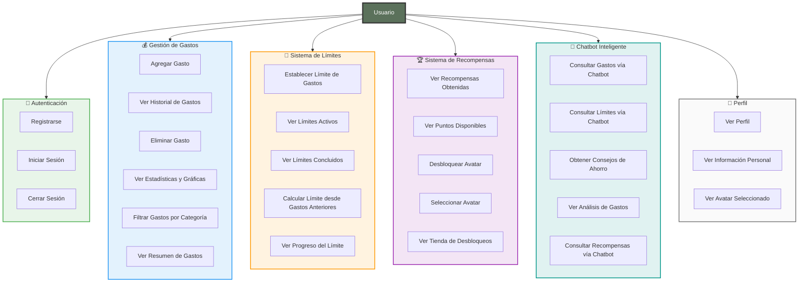
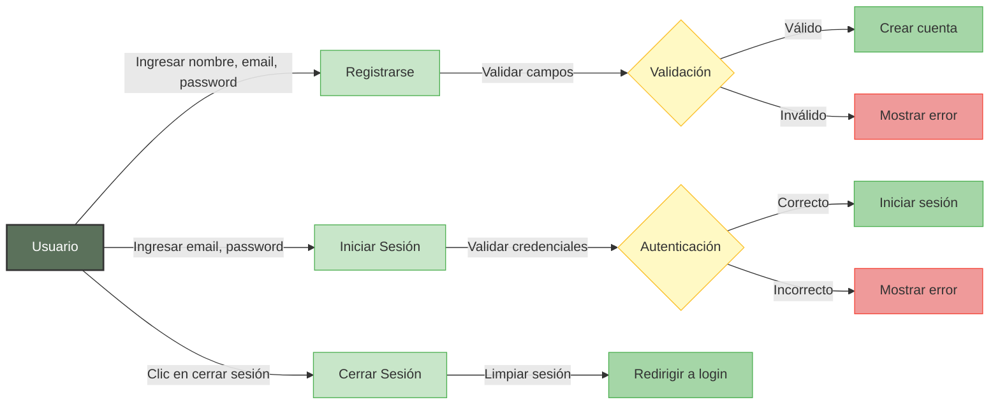
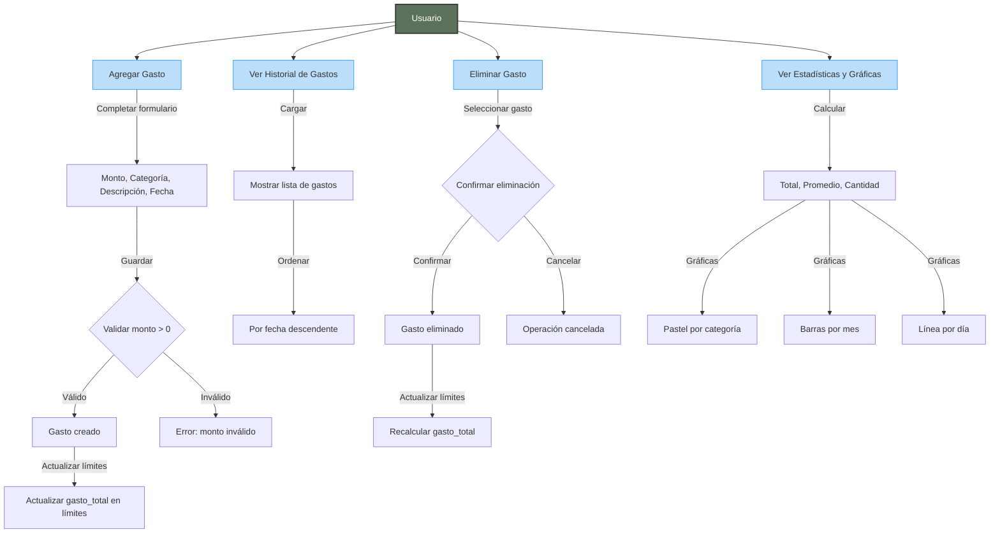
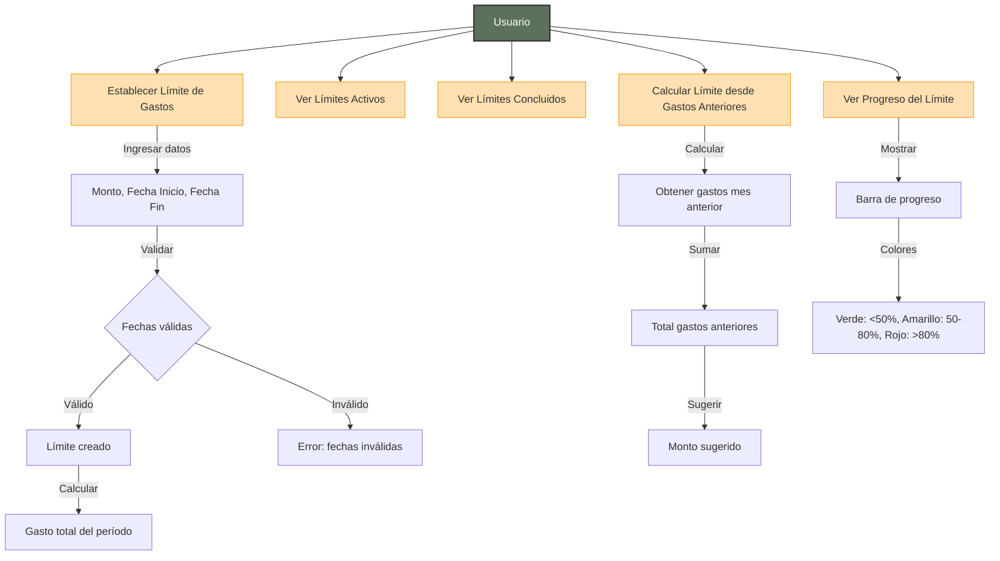
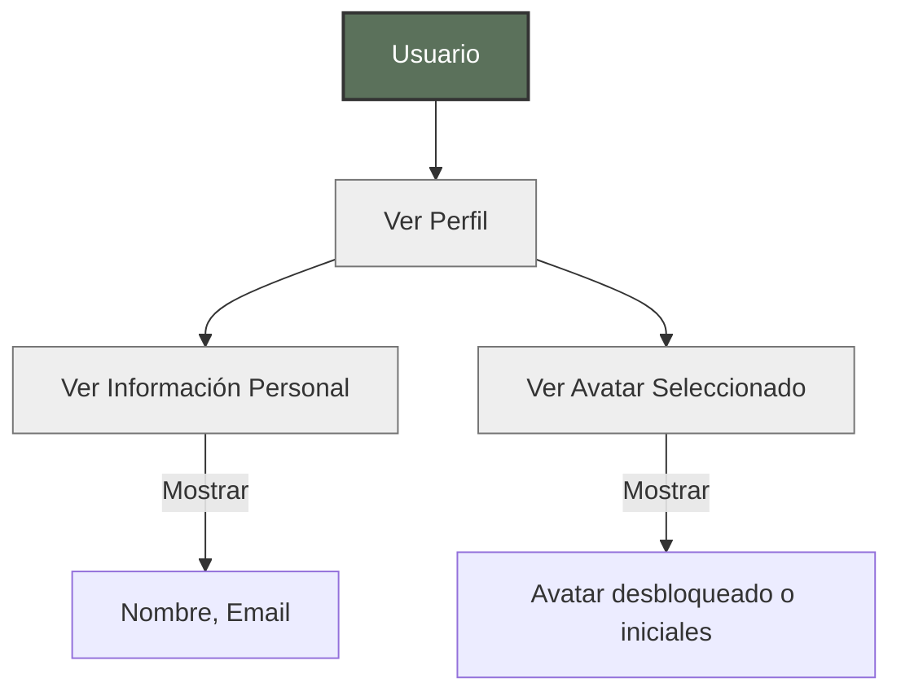
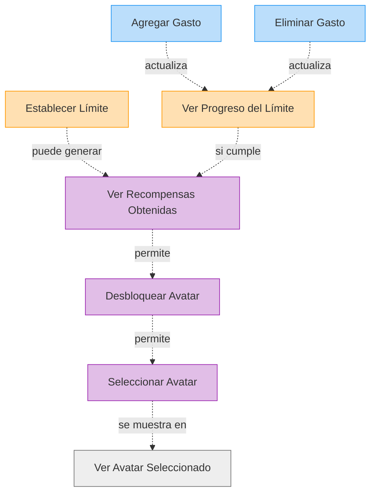

# Diagramas de Caso de Uso - Usuario

Este documento contiene los diagramas de casos de uso específicos para el rol de Usuario en el sistema ExpTrack.

## 📋 Índice

1. [Diagrama General de Casos de Uso de Usuario](#diagrama-general-de-casos-de-uso-de-usuario)
2. [Casos de Uso de Autenticación](#casos-de-uso-de-autenticación)
3. [Casos de Uso de Gestión de Gastos](#casos-de-uso-de-gestión-de-gastos)
4. [Casos de Uso de Sistema de Límites](#casos-de-uso-de-sistema-de-límites)
5. [Casos de Uso de Sistema de Recompensas](#casos-de-uso-de-sistema-de-recompensas)
6. [Casos de Uso de Chatbot](#casos-de-uso-de-chatbot)
7. [Casos de Uso de Perfil](#casos-de-uso-de-perfil)

---

## Diagrama General de Casos de Uso de Usuario



---

## Casos de Uso de Autenticación



### Descripción de Casos de Uso - Autenticación

#### UC1: Registrarse
- **Actor**: Usuario
- **Precondición**: No tener cuenta activa
- **Flujo Principal**:
  1. Usuario ingresa nombre, email y contraseña
  2. Sistema valida formato de email
  3. Sistema valida que el email no esté registrado
  4. Sistema hashea la contraseña
  5. Sistema crea el usuario en la base de datos
  6. Sistema muestra mensaje de éxito
  7. Sistema redirige a la pantalla principal
- **Flujo Alternativo**: Si el email ya existe, mostrar error
- **Postcondición**: Usuario registrado y autenticado

#### UC2: Iniciar Sesión
- **Actor**: Usuario
- **Precondición**: Tener cuenta registrada
- **Flujo Principal**:
  1. Usuario ingresa email y contraseña
  2. Sistema busca usuario por email
  3. Sistema compara contraseña hasheada
  4. Si coincide, inicia sesión
  5. Sistema redirige a la pantalla principal
- **Flujo Alternativo**: Si las credenciales son incorrectas, mostrar error
- **Postcondición**: Usuario autenticado

#### UC3: Cerrar Sesión
- **Actor**: Usuario
- **Precondición**: Estar autenticado
- **Flujo Principal**:
  1. Usuario confirma cerrar sesión
  2. Sistema limpia datos de sesión
  3. Sistema redirige a pantalla de login
- **Postcondición**: Usuario desautenticado

---

## Casos de Uso de Gestión de Gastos



### Descripción de Casos de Uso - Gestión de Gastos

#### UC4: Agregar Gasto
- **Actor**: Usuario
- **Precondición**: Estar autenticado
- **Flujo Principal**:
  1. Usuario abre modal de agregar gasto
  2. Usuario ingresa monto (obligatorio)
  3. Usuario selecciona categoría (opcional)
  4. Usuario ingresa descripción (opcional)
  5. Usuario selecciona fecha (por defecto: hoy)
  6. Usuario guarda el gasto
  7. Sistema valida monto > 0
  8. Sistema crea el gasto en la base de datos
  9. Sistema actualiza gasto_total en límites afectados
  10. Sistema muestra mensaje de éxito
  11. Si se excedió el límite, mostrar alerta especial
- **Flujo Alternativo**: Si monto es inválido, mostrar error
- **Postcondición**: Gasto creado y límites actualizados

#### UC5: Ver Historial de Gastos
- **Actor**: Usuario
- **Precondición**: Estar autenticado
- **Flujo Principal**:
  1. Usuario abre pestaña Historial
  2. Sistema carga todos los gastos del usuario
  3. Sistema ordena por fecha descendente
  4. Sistema muestra lista con: monto, categoría, descripción, fecha
  5. Usuario puede hacer pull-to-refresh para actualizar
- **Postcondición**: Historial mostrado

#### UC6: Eliminar Gasto
- **Actor**: Usuario
- **Precondición**: Tener gastos registrados
- **Flujo Principal**:
  1. Usuario selecciona gasto a eliminar
  2. Sistema muestra confirmación
  3. Usuario confirma eliminación
  4. Sistema elimina el gasto
  5. Sistema recalcula gasto_total en límites afectados
  6. Sistema actualiza la lista
- **Flujo Alternativo**: Si cancela, no se elimina
- **Postcondición**: Gasto eliminado y límites actualizados

#### UC7: Ver Estadísticas y Gráficas
- **Actor**: Usuario
- **Precondición**: Tener gastos registrados
- **Flujo Principal**:
  1. Usuario abre pestaña Home
  2. Sistema calcula total gastado
  3. Sistema calcula promedio por gasto
  4. Sistema cuenta total de gastos
  5. Sistema genera gráfica de pastel por categoría
  6. Sistema genera gráfica de barras por mes (últimos 6 meses)
  7. Sistema genera gráfica de línea por día (últimos 7 días)
  8. Sistema muestra todas las estadísticas
- **Postcondición**: Estadísticas y gráficas mostradas

---

## Casos de Uso de Sistema de Límites



### Descripción de Casos de Uso - Sistema de Límites

#### UC10: Establecer Límite de Gastos
- **Actor**: Usuario
- **Precondición**: Estar autenticado
- **Flujo Principal**:
  1. Usuario abre pestaña Límite
  2. Usuario puede calcular límite desde gastos anteriores o ingresar manualmente
  3. Usuario ingresa monto límite
  4. Usuario selecciona fecha de inicio y fin
  5. Sistema valida que fecha inicio < fecha fin
  6. Sistema crea el límite
  7. Sistema calcula gasto_total inicial del período
  8. Sistema muestra límite creado
- **Flujo Alternativo**: Si fechas son inválidas, mostrar error
- **Postcondición**: Límite creado y activo

#### UC13: Calcular Límite desde Gastos Anteriores
- **Actor**: Usuario
- **Precondición**: Tener gastos en el mes anterior
- **Flujo Principal**:
  1. Usuario selecciona "Calcular desde gastos anteriores"
  2. Sistema obtiene gastos del mes anterior
  3. Sistema suma todos los gastos
  4. Sistema sugiere ese monto como límite
  5. Usuario puede ajustar el monto sugerido
  6. Usuario guarda el límite
- **Flujo Alternativo**: Si no hay gastos anteriores, sugerir ingresar manualmente
- **Postcondición**: Límite sugerido mostrado

---

## Casos de Uso de Sistema de Recompensas

```mermaid
graph TB
    Usuario[Usuario]
    
    UC15[Ver Recompensas Obtenidas]
    UC16[Ver Puntos Disponibles]
    UC17[Desbloquear Avatar]
    UC18[Seleccionar Avatar]
    UC19[Ver Tienda de Desbloqueos]
    
    Usuario --> UC15
    Usuario --> UC16
    Usuario --> UC17
    Usuario --> UC18
    Usuario --> UC19
    
    UC15 -->|Cargar| R9[Lista de recompensas]
    R9 -->|Mostrar| D1[Título, Puntos, Descripción, Fecha]
    
    UC16 -->|Calcular| C5[Puntos totales - Puntos gastados]
    C5 -->|Mostrar| R10[Puntos disponibles]
    
    UC17 -->|Seleccionar item| V5{Puntos suficientes?}
    V5 -->|Sí| C6{Confirmar}
    C6 -->|Confirmar| R11[Avatar desbloqueado]
    C6 -->|Cancelar| E6[Operación cancelada]
    V5 -->|No| E7[Error: puntos insuficientes]
    
    UC18 -->|Seleccionar| V6{Está desbloqueado?}
    V6 -->|Sí| R12[Avatar seleccionado]
    V6 -->|No| E8[Error: desbloquear primero]
    
    style Usuario fill:#5B715B,stroke:#333,stroke-width:2px,color:#fff
    style UC15 fill:#E1BEE7,stroke:#9C27B0
    style UC16 fill:#E1BEE7,stroke:#9C27B0
    style UC17 fill:#E1BEE7,stroke:#9C27B0
    style UC18 fill:#E1BEE7,stroke:#9C27B0
    style UC19 fill:#E1BEE7,stroke:#9C27B0
```



---

## Casos de Uso de Chatbot

```mermaid
graph TB
    Usuario[Usuario]
    
    UC20[Consultar Gastos vía Chatbot]
    UC21[Consultar Límites vía Chatbot]
    UC22[Obtener Consejos de Ahorro]
    UC23[Ver Análisis de Gastos]
    UC24[Consultar Recompensas vía Chatbot]
    
    Usuario --> UC20
    Usuario --> UC21
    Usuario --> UC22
    Usuario --> UC23
    Usuario --> UC24
    
    UC20 -->|Escribir| T1["gastos" o "cuánto gasté"]
    T1 -->|Procesar| P2[Obtener gastos del usuario]
    P2 -->|Calcular| C7[Total, Promedio, Cantidad]
    C7 -->|Responder| R13[Resumen de gastos]
    
    UC21 -->|Escribir| T2["límite" o "presupuesto"]
    T2 -->|Procesar| P3[Obtener límite activo]
    P3 -->|Calcular| C8[Porcentaje usado, Restante]
    C8 -->|Responder| R14[Estado del límite]
    
    UC22 -->|Escribir| T3["consejos" o "ahorro"]
    T3 -->|Procesar| P4[Generar consejos personalizados]
    P4 -->|Responder| R15[Lista de consejos]
    
    UC23 -->|Escribir| T4["análisis" o "estadísticas"]
    T4 -->|Procesar| P5[Calcular estadísticas]
    P5 -->|Responder| R16[Análisis detallado]
    
    style Usuario fill:#5B715B,stroke:#333,stroke-width:2px,color:#fff
    style UC20 fill:#B2DFDB,stroke:#009688
    style UC21 fill:#B2DFDB,stroke:#009688
    style UC22 fill:#B2DFDB,stroke:#009688
    style UC23 fill:#B2DFDB,stroke:#009688
    style UC24 fill:#B2DFDB,stroke:#009688
```

---

## Casos de Uso de Perfil



---

## Relaciones entre Casos de Uso



---

**Última actualización**: 2024
**Versión del documento**: 1.0

