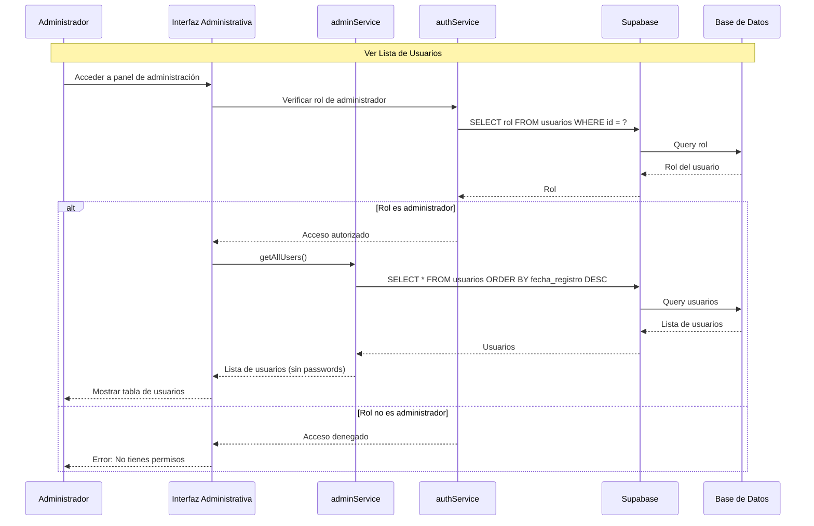
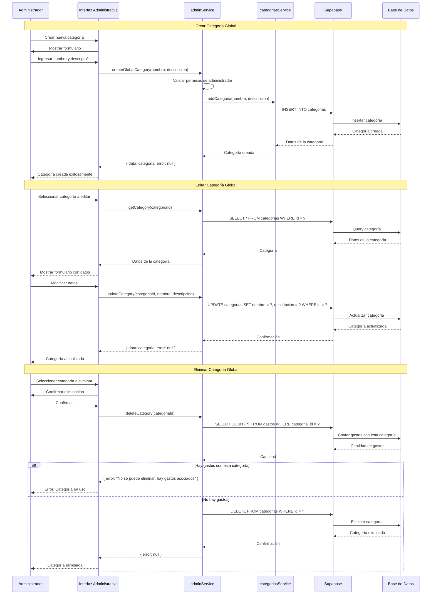
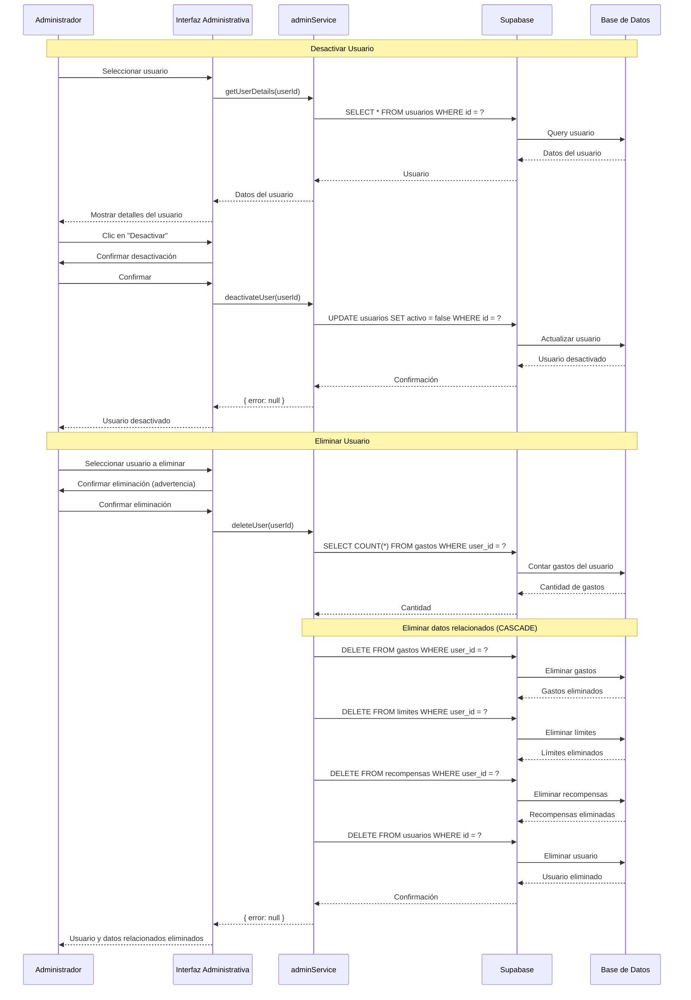
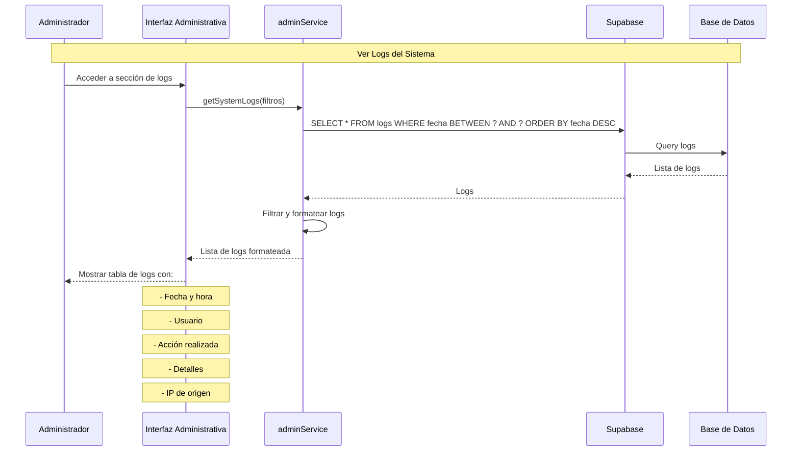

# Diagramas de Secuencia - Administrador

## ⚠️ Nota Importante

**Este documento no aplica para el sistema ExpTrack actual.**

### Razón

El sistema ExpTrack es una aplicación móvil de seguimiento de gastos personales diseñada exclusivamente para usuarios finales. No existe un rol de administrador en la arquitectura actual del sistema.

### Arquitectura Actual

- **Tipo de Sistema**: Aplicación móvil personal
- **Usuarios**: Solo usuarios finales
- **Modelo de Datos**: Cada usuario gestiona únicamente sus propios datos
- **Seguridad**: Aislamiento de datos mediante `user_id` en todas las tablas

---

## Si se implementara un rol de administrador en el futuro

A continuación se presentan diagramas de secuencia hipotéticos para operaciones administrativas que podrían implementarse en el futuro:

---

## Diagrama de Secuencia - Ver Lista de Usuarios (Futuro)



---

## Diagrama de Secuencia - Gestionar Categorías Globales (Futuro)



---

## Diagrama de Secuencia - Ver Estadísticas Globales (Futuro)

```mermaid
sequenceDiagram
    participant Admin as Administrador
    participant UI as Interfaz Administrativa
    participant AS as adminService
    participant SB as Supabase
    participant DB as Base de Datos

    Note over Admin,DB: Ver Estadísticas Globales
    Admin->>UI: Acceder a panel de estadísticas
    UI->>AS: getGlobalStatistics()
    AS->>SB: SELECT COUNT(*) FROM usuarios
    SB->>DB: Contar usuarios
    DB-->>SB: Total de usuarios
    SB-->>AS: Total usuarios
    
    AS->>SB: SELECT COUNT(*) FROM gastos
    SB->>DB: Contar gastos
    DB-->>SB: Total de gastos
    SB-->>AS: Total gastos
    
    AS->>SB: SELECT SUM(monto) FROM gastos
    SB->>DB: Sumar montos
    DB-->>SB: Total gastado
    SB-->>AS: Total gastado
    
    AS->>SB: SELECT COUNT(*) FROM limites
    SB->>DB: Contar límites
    DB-->>SB: Total de límites
    SB-->>AS: Total límites
    
    AS->>SB: SELECT COUNT(*) FROM recompensas
    SB->>DB: Contar recompensas
    DB-->>SB: Total de recompensas
    SB-->>AS: Total recompensas
    
    AS->>AS: Calcular promedios y métricas
    AS-->>UI: {
        totalUsuarios,
        totalGastos,
        totalGastado,
        totalLimites,
        totalRecompensas,
        promedioGastosPorUsuario,
        promedioGastadoPorUsuario
    }
    UI-->>Admin: Mostrar dashboard con estadísticas
```

---

## Diagrama de Secuencia - Gestionar Usuario (Futuro)



---

## Diagrama de Secuencia - Ver Logs del Sistema (Futuro)



---

## Consideraciones para Implementación Futura

Si se decide implementar funcionalidad administrativa, se requeriría:

### 1. Modificaciones en la Base de Datos

```sql
-- Agregar campo de rol
ALTER TABLE usuarios ADD COLUMN rol TEXT DEFAULT 'usuario';

-- Crear tabla de logs
CREATE TABLE logs (
  id SERIAL PRIMARY KEY,
  user_id INTEGER REFERENCES usuarios(id),
  accion TEXT NOT NULL,
  detalles TEXT,
  ip_origen TEXT,
  fecha TIMESTAMP DEFAULT CURRENT_TIMESTAMP
);

-- Crear tabla de configuración
CREATE TABLE configuracion (
  clave TEXT PRIMARY KEY,
  valor TEXT NOT NULL,
  descripcion TEXT,
  fecha_actualizacion TIMESTAMP DEFAULT CURRENT_TIMESTAMP
);
```

### 2. Nuevos Servicios

- `adminService.js`: Funciones administrativas
- `logService.js`: Registro de actividades
- `configService.js`: Gestión de configuración del sistema

### 3. Políticas de Seguridad

- Implementar RLS (Row Level Security) en Supabase
- Validar rol de administrador en cada operación
- Registrar todas las acciones administrativas

### 4. Interfaz de Usuario

- Panel de administración separado
- Navegación condicional basada en rol
- Componentes de gestión administrativa

---

## Conclusión

**Estado Actual**: No hay funcionalidad de administrador en ExpTrack.

**Recomendación**: Si se requiere funcionalidad administrativa en el futuro, se debe planificar como una nueva característica que incluya:
- Diseño detallado de casos de uso administrativos
- Diagramas de secuencia para cada operación
- Actualización de la arquitectura del sistema
- Implementación de seguridad y auditoría

---

**Última actualización**: 2024
**Versión del documento**: 1.0
**Estado**: No aplica - Sistema sin rol de administrador

