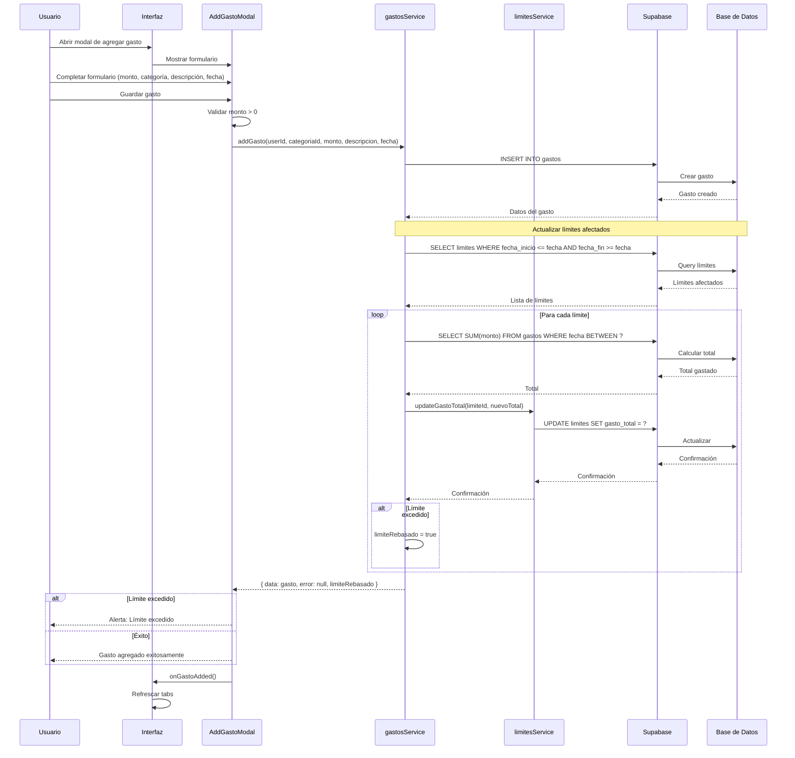
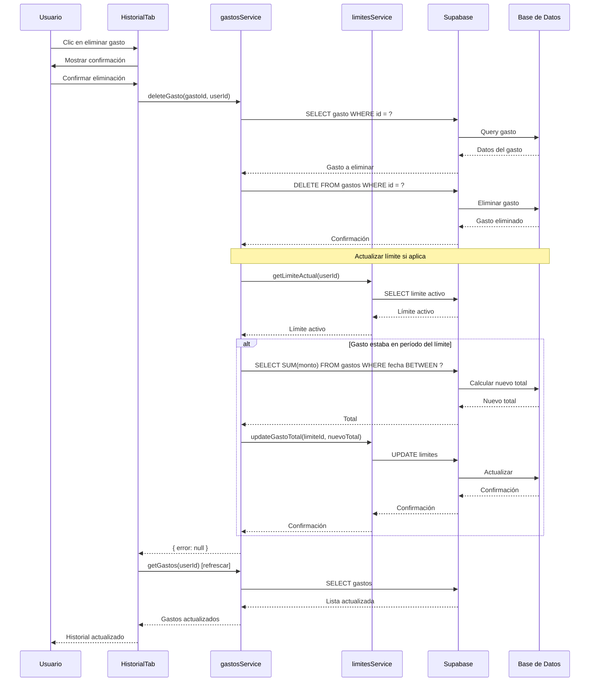
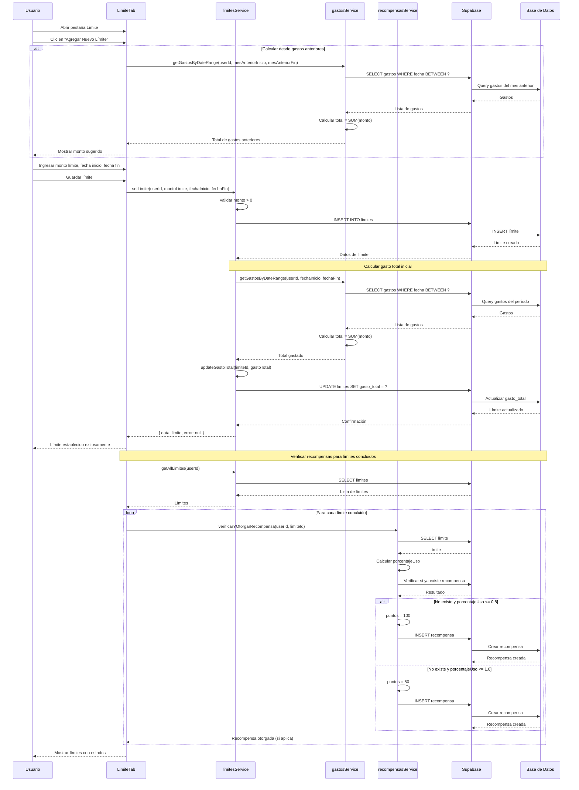
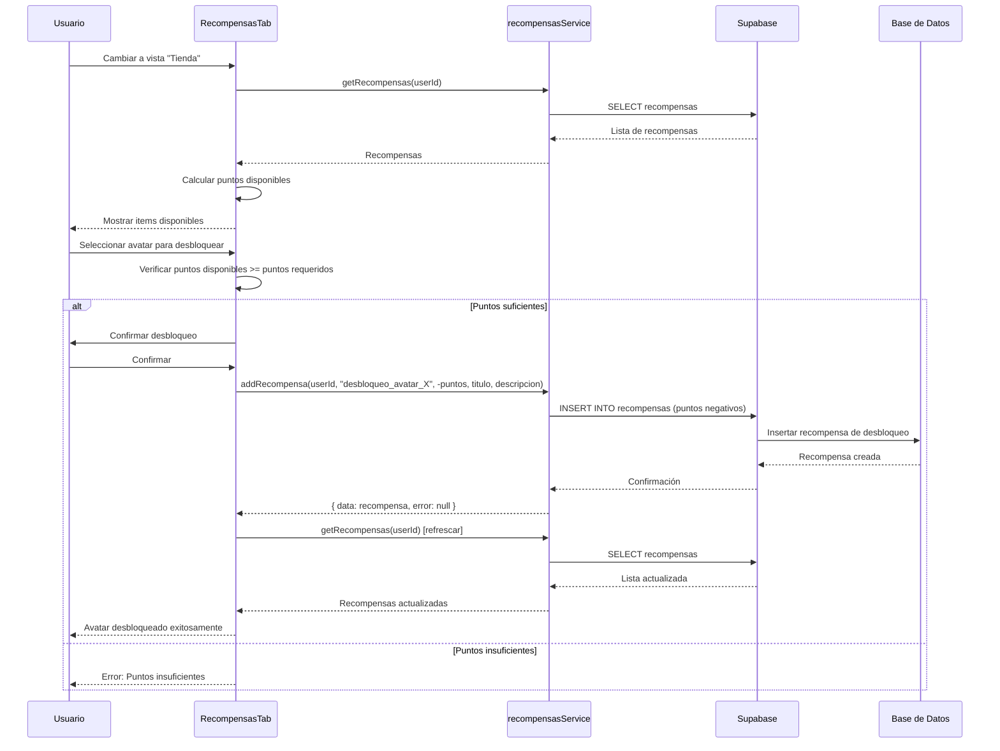
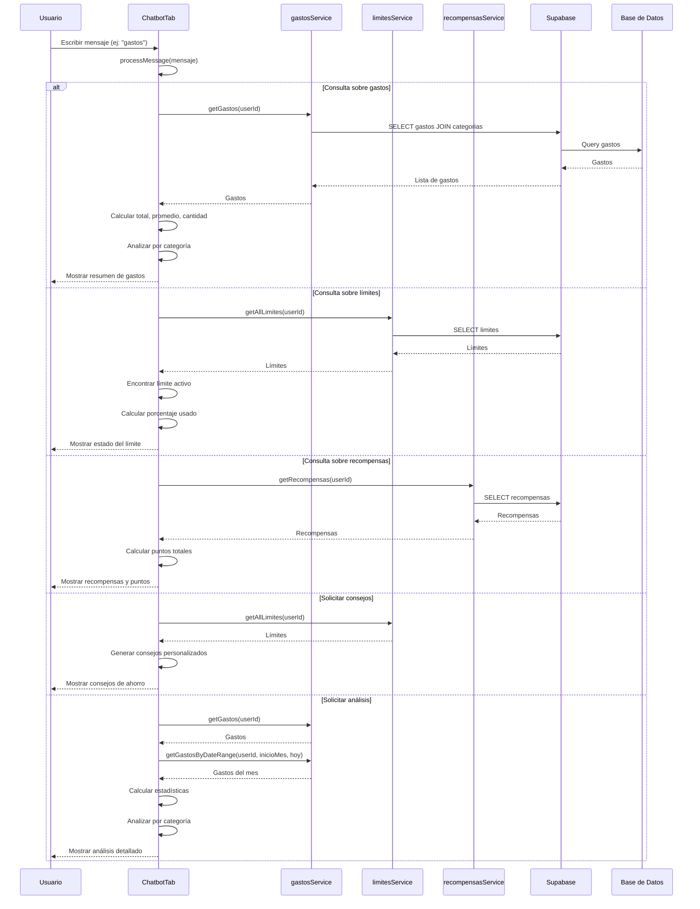
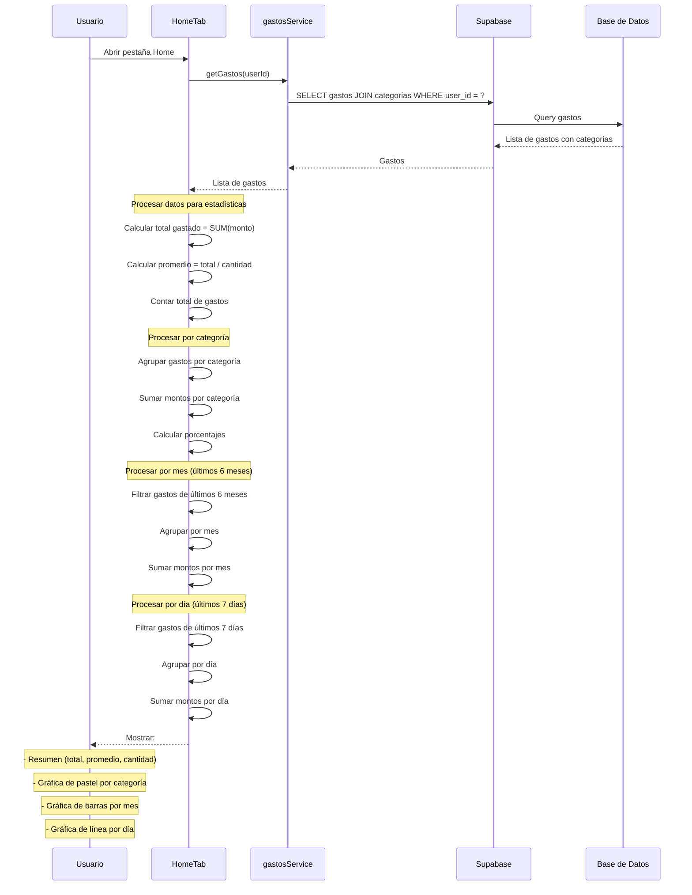
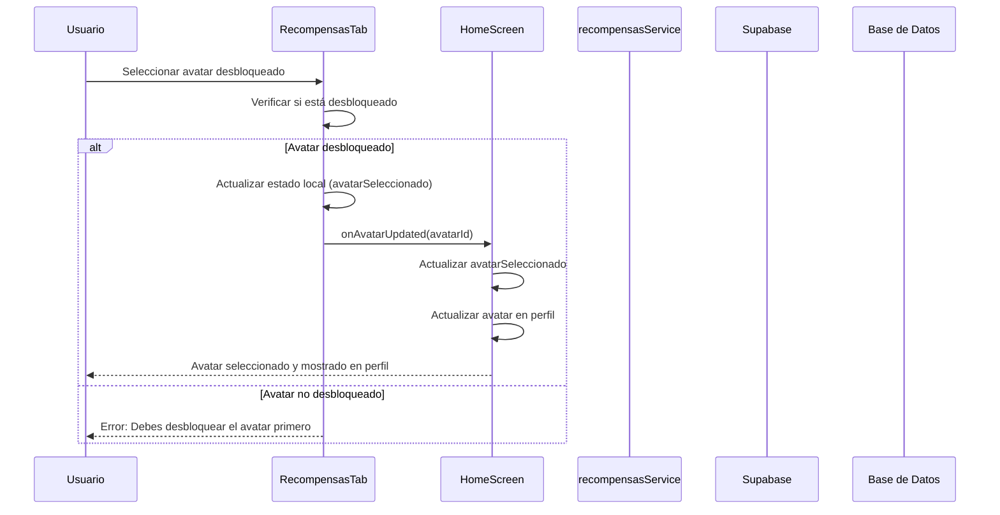

# Diagramas de Secuencia - Usuario

Este documento contiene los diagramas de secuencia específicos para las operaciones del Usuario en el sistema ExpTrack.

## 📋 Índice

1. [Agregar Gasto](#diagrama-de-secuencia---agregar-gasto)
2. [Eliminar Gasto](#diagrama-de-secuencia---eliminar-gasto)
3. [Establecer Límite](#diagrama-de-secuencia---establecer-límite)
4. [Desbloquear Avatar](#diagrama-de-secuencia---desbloquear-avatar)
5. [Consultar Chatbot](#diagrama-de-secuencia---consultar-chatbot)
6. [Ver Estadísticas](#diagrama-de-secuencia---ver-estadísticas)

---

## Diagrama de Secuencia - Agregar Gasto

---

## Diagrama de Secuencia - Eliminar Gasto

---

## Diagrama de Secuencia - Establecer Límite

---

## Diagrama de Secuencia - Desbloquear Avatar

---

## Diagrama de Secuencia - Consultar Chatbot

---

## Diagrama de Secuencia - Ver Estadísticas

---

## Diagrama de Secuencia - Seleccionar Avatar

---

**Última actualización**: 2024
**Versión del documento**: 1.0

